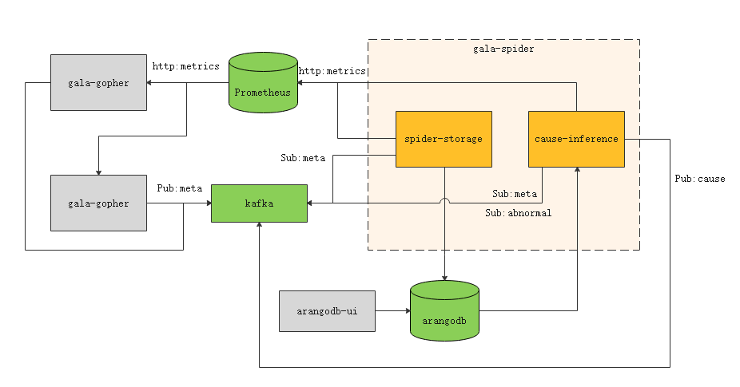
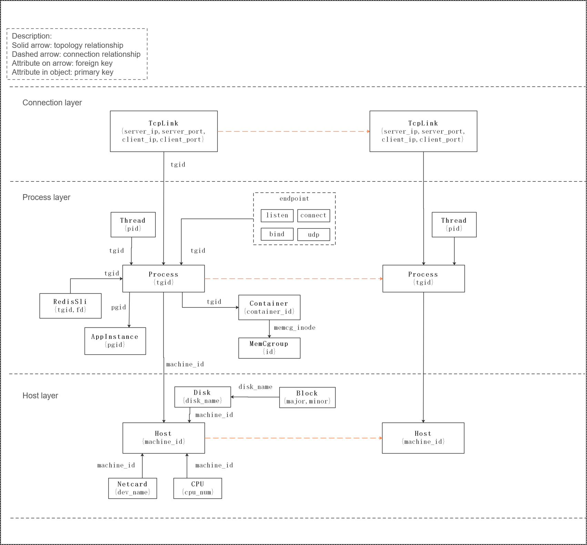

# gala-spider

gala-spider provides the OS-level topology drawing function. It periodically obtains the data of all observed objects collected by gala-gopher (OS-level data collection software) at a certain time point and calculates the topology relationship between them. The generated topology is saved to the graph database ArangoDB.

## Functions and Features

The gala-spider project provides two functional modules:

- **spider-storage**: provides the topology drawing function for OS-level observed objects. The topology is stored in the graph database ArangoDB and can be queried on the UI provided by ArangoDB.
- **gala-inference**: provides the capability of locating root causes of abnormal KPIs. It uses the exception detection result and topology as the input and outputs the root cause locating result to Kafka.

## Software Architecture



The dotted box indicates the two functional components of gala-spider. The green parts indicate the external components that gala-spider directly depends on, and the gray parts indicate the external components that gala-spider indirectly depends on.

- **spider-storage**: core component of gala-spider, which provides the topology storage function. It obtains the metadata of the observed objects from Kafka, obtains information about all observed object instances from Prometheus, and saves the generated topology to the graph database ArangoDB.
- **gala-inference**: core component of gala-spider, which provides the root cause locating function. It subscribes to abnormal KPI events from Kafka to trigger the root cause locating process of abnormal KPIs, constructs a fault propagation graph based on the topology obtained from ArangoDB, and outputs the root cause locating result to Kafka.
- **Prometheus**: time series database. The metric data collected by gala-gopher is reported to Prometheus for further processing by gala-spider.
- **Kafka**: messaging middleware, which stores the metadata of the observed objects reported by gala-gopher, exception events reported by the exception detection component, and root cause locating result reported by the cause-inference component.
- **ArangoDB**: graph database, which is used to store the topology generated by spider-storage.
- **gala-gopher**: data collection component. For details, see [gala-gopher project](https://atomgit.com/openeuler/gala-spider/pull/33).
- **arangodb-ui**: UI provided by ArangoDB, which can be used to query the topology.

## Quick Start

### Deployment of gala-spider

#### Deployment of spider-storage

1. Compiling, installing, and running from source code

   - Build.

     ```shell
     /usr/bin/python3 setup.py build
     ```

   - Install.

     ```shell
     /usr/bin/python3 setup.py install
     ```

   - Run.

     ```shell
     spider-storage
     ```

2. Installing and running based on RPM packages

   - Configure the Yum source.

     ```shell
     [oe-2209]      # openEuler 22.09 official repository
     name=oe2209
     baseurl=http://119.3.219.20:82/openEuler:/22.09/standard_x86_64
     enabled=1
     gpgcheck=0
     priority=1
     
     [oe-2209:Epol] # openEuler 22.09: official EPOL repository
     name=oe2209_epol
     baseurl=http://119.3.219.20:82/openEuler:/22.09:/Epol/standard_x86_64/
     enabled=1
     gpgcheck=0
     priority=1
     ```

   - Install.

     ```shell
     yum install gala-spider
     ```

   - Run.

     ```shell
     systemctl start gala-spider
     ```

3. Deploying based on Docker containers

   - Generate a container image.

     In the root directory of the gala-spider project, run the following command:

     ```sh
     docker build -f ./ci/gala-spider/Dockerfile -t gala-spider:1.0.0 .
     ```

     Note that dependency packages need to be downloaded from the pip source during container image generation. If the default pip source is unavailable, you can modify `./ci/gala-spider/Dockerfile` to configure an available pip source. The following is an example:

     ```sh
     # config pip source
     RUN pip3 config set global.index-url https://mirrors.tools.huawei.com/pypi/simple \
         && pip3 config set install.trusted-host mirrors.tools.huawei.com
     ```

   - Run the container.

     In the deployment environment, run the following command:

     ```sh
     docker run -e prometheus_server=192.168.122.251:9090 -e arangodb_server=192.168.122.103:8529 -e kafka_server=192.168.122.251:9092 -e log_level=DEBUG gala-spider:1.0.0
     ```

     Environment variables: If not specified, the default configuration in the configuration file is used.

     - **prometheus_server**: specifies the address of the Prometheus server.
     - **arangodb_server**: specifies the address of the ArangoDB server.
     - **kafka_server**: specifies the address of the Kafka server.
     - **log_level**: specifies the gala-spider log level.

     If you need to start the container from the configuration file of the host machine, you can mount a volume by running the following command:

     ```sh
     docker run -e prometheus_server=192.168.122.251:9090 -e arangodb_server=192.168.122.103:8529 -e kafka_server=192.168.122.251:9092 -e log_level=DEBUG -v /etc/gala-spider:/etc/gala-spider -v /var/log/gala-spider:/var/log/gala-spider gala-spider:1.0.0
     ```

     It should be noted that:

     - If the configuration file does not exist in the `/etc/gala-spider` directory on the host machine, the container copies the default configuration file to the `/etc/gala-spider` directory on the host machine when the container is started for the first time.
     - If the configuration file already exists in the `/etc/gala-spider` directory on the host machine, it will overwrite the default configuration file in the container. In this case, the configuration items specified by the `-e` parameter will become invalid.

     You can use `-v /var/log/gala-spider:/var/log/gala-spider` to map the log files generated during container running to the host machine for future viewing.

#### Deployment of gala-inference

1. Compiling, installing, and running from source code

   - Build.

     ```shell
     /usr/bin/python3 setup.py build
     ```

   - Install.

     ```shell
     /usr/bin/python3 setup.py install
     ```

   - Run.

     ```shell
     gala-inference
     ```

2. Installing based on RPM packages

    - Configure the Yum source.

      The configuration is the same as that of the Yum source in deployment of spider-storage.

    - Install.

      ```sh
      yum install gala-inference
      ```

    - Run.

      ```sh
      systemctl start gala-inference
      ```

3. Deploying based on Docker containers

    - Generate a container image.

      In the root directory of the gala-spider project, run the following command:

      ```sh
      docker build -f ./ci/gala-inference/Dockerfile -t gala-inference:1.0.0 .
      ```

      Note that dependency packages need to be downloaded from the pip source during container image generation. If the default pip source is unavailable, you can modify `./ci/gala-inference/Dockerfile` to configure an available pip source. The following is an example:

      ```sh
      # config pip source
      RUN pip3 config set global.index-url https://mirrors.tools.huawei.com/pypi/simple \
          && pip3 config set install.trusted-host mirrors.tools.huawei.com
      ```

    - Run the container.

      In the deployment environment, run the following command:

      ```sh
      docker run -e prometheus_server=192.168.122.251:9090 -e arangodb_server=192.168.122.103:8529 -e kafka_server=192.168.122.251:9092 -e log_level=DEBUG gala-inference:1.0.0
      ```

      Environment variables: If not specified, the default configuration in the configuration file is used.

      - **prometheus_server**: specifies the address of the Prometheus server.
      - **arangodb_server**: specifies the address of the ArangoDB server.
      - **kafka_server**: specifies the address of the Kafka server.
      - **log_level**: specifies the gala-inference log level.

      If you need to start the container from the configuration file of the host machine, you can mount a volume by running the following command:

      ```sh
      docker run -e prometheus_server=192.168.122.251:9090 -e arangodb_server=192.168.122.103:8529 -e kafka_server=192.168.122.251:9092 -e log_level=DEBUG -v /etc/gala-inference:/etc/gala-inference -v /var/log/gala-inference:/var/log/gala-inference gala-inference:1.0.0
      ```

      It should be noted that:

      - If the configuration file does not exist in the `/etc/gala-inference` directory on the host machine, the container copies the default configuration file to the `/etc/gala-inference` directory on the host machine when the container is started for the first time.
      - If the configuration file already exists in the `/etc/gala-inference` directory on the host machine, it will overwrite the default configuration file in the container. In this case, the configuration items specified by the `-e` parameter will become invalid.

      You can use `-v /var/log/gala-inference:/var/log/gala-inference` to map the log files generated during container running to the host machine for future viewing.

### Deployment of gala-spider External Dependencies

- Prometheus
- Kafka
- **ArangoDB**

#### Deployment of ArangoDB

ArangoDB operating environment requirements:

- x86
- GCC 10 or later

The ArangoDB version used is 3.8.7. For details about how to deploy ArangoDB, see [ArangoDB Deployment](https://www.arangodb.com/docs/3.9/deployment.html).

1. Deploying using RPM

   Install ArangoDB 3 from the openEuler 22.09 EPOL repository.
   
   ```sh
   yum install arangodb3
   ```
   
   Starts the ArangoDB 3 server.
   
   ```sh
   systemctl start arangodb3
   ```
   
   Before starting the server, you can edit the `/etc/arangodb3/arangod.conf` file to modify the configuration. For example, you can set `authentication = false` to disable identity authentication.
   
2. Deploying using Docker

   ```shell
   docker run -e ARANGO_NO_AUTH=1 -p 192.168.0.1:10000:8529 arangodb/arangodb arangod \
     --server.endpoint tcp://0.0.0.0:8529\
   ```

   Description of the options:

   - `arangod --server.endpoint tcp://0.0.0.0:8529`: starts the arangod service in the container. `--server.endpoint` specifies the server address.

   - `-e ARANGO_NO_AUTH=1`: configures the environment variable for ArangoDB identity authentication. `ARANGO_NO_AUTH=1` indicates that identity authentication is not enabled, meaning that the ArangoDB database can be accessed without a username or password. This configuration is used in the test environment.
   - `-p 192.168.0.1:10000:8529`: establishes port forwarding from a local IP address (port 1000 of `192.168.0.1` in this example) to port 8529 of the ArangoDB container.

   For details, see [Deploying ArangoDB Using Docker](https://www.arangodb.com/docs/3.9/deployment-docker.html).

## Instructions

### Configuration File Introduction

[Configuration File Introduction](docs/guide/zh-CN/conf_introduction.md)

### 3D Topology Hierarchical Architecture



Description of the observed objects:

1. Host: host or VM node
    - **machine_id**: host ID, which identifies a host or VM on the network.
  
2. Container: container node
    - **container_id**: container ID, which identifies a container on a host or VM.
    - **machine_id**: host ID, which associates the host or VM to which a container belongs.
    - **netns**: net namespace where a container is located.
    - **mntns**: mount namespace where a container is located.
    - **netcgrp**: net cgroup associated with a container.
    - **memcgrp**: memory cgroup associated with a container.
    - **cpucgrp**: CPU cgroup associated with a container.
    
3. Task: process node
    - **pid**: process ID, which identifies a process running on a host, VM, or container.
    - **machine_id**: host ID, which associates the host or VM to which a process belongs.
    - **container_id**: container ID, which associates the container to which a process belongs.
    - **tgid**: process group ID
    - **pidns**: PID namespace where a process is located.
    
4. Endpoint: communication endpoint of a process
    - **type**: endpoint type, such as TCP or UDP
    - **ip**: IP address bound to an endpoint, which is optional.
    - **port**: port number bound to an endpoint, which is optional.
    - **pid**: process ID, which associates the process to which an endpoint belongs.
    - **netns**: net namespace where an endpoint is located.
    
5. Jvm: Java program runtime
6. Python: Python program runtime
7. Golang: Go program runtime

8. AppInstance: application instance node
    - **pgid**: process group ID, which identifies an application instance.
    - **machine_id**: host ID, which associates the host or VM to which an application instance belongs.
    - **container_id**: container ID, which associates the container to which an application instance belongs.
    - **exe_file**: executable file of an application, which identifies an application.
    - exec_file: executed file of an application, which identifies an application.

### API Documents

[Topology Query RESTful API](docs/guide/zh-CN/api/3d-topo-graph.md)

[Root Cause Locating Result API](docs/guide/zh-CN/api/cause-infer.md)

### Method of Adding an Observed Object

[How to Add an Observed Object](docs/devel/zh-CN/how_to_add_new_observe_object.md)

## Project Roadmap

| Feature                                                        | Release Date| Release Version           |
| ------------------------------------------------------------ | -------- | ------------------- |
| Construction of real-time service topology for applications based on TCP sessions (including Nginx and HAProxy sessions) | 2022-12   | openEuler 22.03 SP1 |
| Construction of dependency topology for intra-host application resources (including QEMU topology)            | 2022-12   | openEuler 22.03 SP1 |
| Construction of real-time K8s pod topology based on Layer 7 sessions (including HTTP1.X/MySQL/PGSQL/Redis/Kafka/MongoDB/DNS/RocketMQ)| 2023-09   | openEuler 22.03 SP1 |
| Construction of real-time topology of software-defined storage (Ceph)                              | 2024-03   | openEuler 24.03     |
|                                                              |          |                     |
