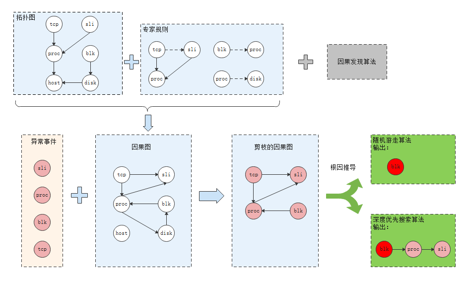
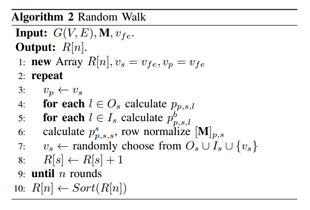

# 根因定位方案设计和开发

## 方案设计

根因定位整体方案如下：



（说明：灰色部分暂不涉及，会在后续版本考虑进来。）

主要步骤如下：

1. 根据上报的异常KPI事件，触发根因定位流程。
2. 获取异常KPI事件所在时间点的拓扑图。根据异常KPI事件的时间点、异常KPI指标对应的观测实例，查询arangodb，获取以异常观测实例为起点的一个拓扑子图。
3. 基于获取的拓扑图，结合录入的专家规则，构建实时的因果图。
4. 对因果图进行剪枝，删除没有故障的节点。故障节点是指包含异常指标的观测实例。
5. 以异常KPI指标为起点，根据剪枝的因果图进行根因推导，输出top3的根因指标。


### 专家规则

现有专家规则包括：

```
规则1：如果 tcp_link 观测实例 A 和 sli 观测实例 B 属于同一个 process 观测实例 C，则建立 A 到 B 的因果关系。
规则2：如果 sli 观测实例 A 到 process 观测实例 B 存在 belongs_to 关系，则建立 B 到 A 的因果关系。
规则3：如果 block 观测实例 A 到 disk 观测实例 B 存在 belongs_to 关系，则建立 B 到 A 的因果关系。
规则4：如果 disk 观测实例 A 和 process 观测实例 B 属于同一个主机，则建立 B 到 A 的因果关系。
规则5：如果 block 观测实例 A 和 process 观测实例 B 属于同一个主机，则建立 A 到 B 的因果关系。
规则6：如果观测实例 A 到观测实例 B 存在 runs_on 关系，则建立 B 到 A 的因果关系。
规则7：如果观测实例 A 到观测实例 B 存在 belongs_to 关系，则建立 A 到 B 的因果关系。
```


### 因果图构建

输入：

- 异常 KPI 事件
  - 异常发生时间点
  - 异常 KPI 对应的观测实例
  - 推荐的根因指标
- 基于实体粒度的因果专家规则
- 拓扑图


构建流程如下：

1. 获取拓扑图：根据异常KPI事件的时间点、异常KPI指标对应的观测实例，查询arangodb，获取以异常观测实例为起点的一个拓扑子图，记作 $G^T$。
2. 初始因果图构建：在拓扑图 $G^T$ 上，解析专家规则，将满足条件的观测实例之间建立因果关系，生成观测实例之间的因果图，记作 $G^{IC}$ 。
3. 因果图剪枝：遍历因果图 $G^{IC}$ 中的所有观测实例节点，如果不为故障节点，则从图中删除该节点以及与它相连的邻边。最终生成剪枝后的因果图，记作 $G^{PC}$ 。
4. 生成异常指标之间的因果图：遍历因果图 $G^{PC}$ 中每条观测实例节点之间的因果关系，如果观测实例 A 到观测实例 B 存在一条因果关系，则建立观测实例 A 上所有异常观测指标到观测实例 B 上所有异常观测指标之间的因果关系。最终生成异常指标之间的因果图，记作 $G^{MC}$ ，此时图中的节点表示异常观测指标。


#### 引入系统异常事件

因果图构建的输入中纳入系统异常事件。

实现方案设计：

1. 除了将异常检测推荐的指标作为**可能的根因指标集合**，gala-gopher 产生的系统异常事件的集合并入到**可能的根因指标集合**。
2. 如何评估系统异常事件对KPI的影响得分：将系统异常事件的影响性优先级设置为最高，即影响得分设置为 1 。
3. 如何确定此次根因定位的系统异常事件的集合：以异常KPI发生的时间点为终点，取最近2分钟（可配置）发生的系统异常事件作为此次根因定位的有效集合。
4. 如何获取系统异常事件的集合：创建一个 AbnMetricEvtMgt 类进行管理，每次触发KPI根因定位时会从kafka循环消费系统异常事件并保存，直到系统异常事件发生的时间点超过当前KPI发生的时间点；设置一个老化时间（可配置，比如10分钟），将超过该老化时间的历史系统异常事件从集合中删除；从当前集合中取最近2分钟（可配置）发生的系统异常事件作为此次根因定位的有效集合。


### 根因推导

#### 随机游走算法

根据因果图 $G^{MC}$ ，使用随机游走算法，输出 topK 的根因指标。



输入：有向图G，V为服务节点集，E为边集，M为转移概率矩阵，$v_{fe}$为异常的SLI指标。

输出：随机游走结束后每个服务节点经过的次数。

算法步骤：

- 步骤1：以 $v_{fe}$ 作为起点，运行随机游走算法；

- 步骤2：重复 n 轮，每轮：计算当前节点的前向、后向、自向转移概率，基于概率随机选择下一个节点；

- 步骤3：对每个异常指标节点经过的次数排序，选择次数最多的 topK 异常指标节点作为根因。

#### 深度优先搜索算法

根据因果图 $G^{MC}$ ，使用深度优先搜索算法，输出 topK 的根因传播路径，并将传播路径的起始节点作为根因指标。

路径评分：对于给定根因传播路径 $path = {m_1, m_2, ..., m_k}$ ，它的根因得分为， 
$$
score(path) = \{\sum_{i=1}^{k-1}abn_{m_i}\} / (k-1).
$$
其中，$abn_{m_i}$ 表示指标 $m_i$ 对异常 KPI 的影响性得分。另外， $m_k$ 即为异常 KPI ，因此不加入根因得分的计算。


### 输入输出

#### 根因定位输出格式

参见[这里](../../guide/zh-CN/api/cause-infer.md)。
